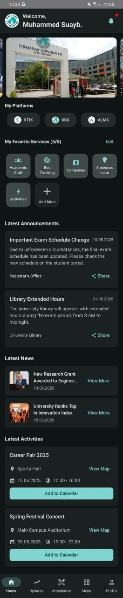
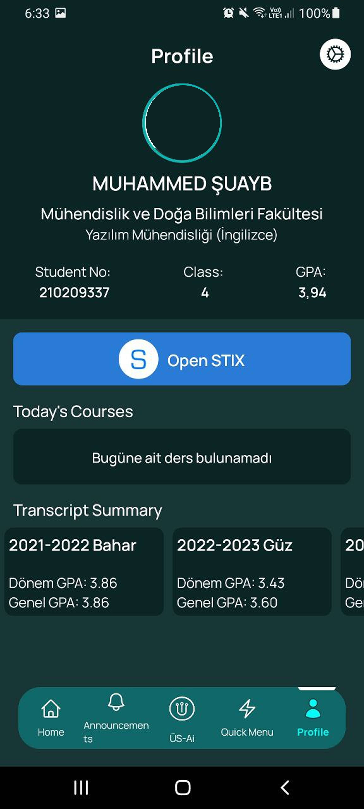

# Üsküdar University — Mobile App (UI/UX Redesign) 🚀

This repository contains a Jetpack Compose Android implementation of a UI/UX redesign for the official Üsküdar University mobile app. The redesign improves usability, visual clarity, accessibility, and feature discoverability based on structured analysis (user interviews, questionnaires, task observations, and visual-attention testing). The repo includes the original app screenshots and the redesigned app screenshots for direct comparison.

> Contents: production-ready UI code, the design report (`UI_UX_Report.pdf`) documenting research and findings, and sample data to run the app locally.

---

## Demo — Old (current) vs Redesigned 📱➡️🎨

**Note:** These are partial screenshots of the core app’s UI. For a full experience, please download the project.

| **Page/Feature**            | **Old (current app)**                                   | **Redesigned (this repo)**                                   |
|-----------------------------|------------------------------------------------------|------------------------------------------------------|
| **HomePage**                 | <p float="left"></p> | <p float="left"></p> |
| **Quick Menu / Services**    | <p float="left"></p> | <p float="left"></p> |
| **STIX / Course List**       | <p float="left"></p> | <p float="left"></p> |
| **Weekly Schedule**          | <p float="left"></p> | <p float="left"></p> |
| **Student Profile**          | <p float="left"></p> | <p float="left"></p> |
| **Profile Setting**          | <p float="left"></p> | <p float="left"></p> |
| **Ring Hours**               | <p float="left"></p> | <p float="left"></p> |

---

## Project highlights ⭐
- End-to-end redesign focused on discoverability and task efficiency.  
- Evidence-based decisions driven by user research and visual-attention analysis.  
- Modular Jetpack Compose architecture facilitating reuse and maintainability.  
- Clear theming and accessibility improvements (contrast, scalable type, semantics).  
- Before/after artifacts included to show concrete improvements.

---

## Design & research summary 📋
- Methods: user interviews, task observation, questionnaires, and visual-attention testing.  
- Outputs: personas, prioritized pain points, wireframes, high-fidelity mockups, and heatmap analyses.  
- Key outcomes: simplified navigation, surfaced quick actions, readable schedule layout, and consistent visual language.  
(Full methodology, raw data and visualizations are in `UI_UX_Report.pdf`.)

---

## Key improvements (summary → solutions) 🔧
- **Problem:** Important features were buried in menus.  
  **Solution:** Home reorganized to surface favorites & quick actions.
- **Problem:** Weekly schedule hard to scan.  
  **Solution:** Collapsible, grouped schedule with better visual hierarchy and quick toggles.
- **Problem:** Visual clutter & inconsistent typography.  
  **Solution:** Unified Material 3-based theme, consistent spacing, and improved contrast.
- **Problem:** Lack of fast-access actions (QR attendance, STIX messages).  
  **Solution:** Quick Menu + persistent shortcuts on Home.

---

## Features ✨
- Modern Jetpack Compose UI built with Material 3 principles  
- Home dashboard with favorites and quick-access tiles  
- Quick Menu with filters and view toggle (grid/list)  
- STIX-like screens (course list, messages, attendance)  
- Weekly schedule with collapsible day cards  
- Light & Dark theme support  
- WebView pages for external links  
- Placeholder for QR attendance flow (extendable)  
- Demo/sample data for quick local testing

---

## Tech stack 🛠️
- **Language:** Kotlin  
- **UI:** Jetpack Compose (Material 3)  
- **Architecture:** MVVM-style (ViewModels + Composables)  
- **Build:** Android Studio (Gradle)  
- **Notable libs:** Kotlin Coroutines, Navigation Compose, Coil (image loading)  
(See `build.gradle` for exact versions.)

---

## Project structure (high level) 📂
```
app/
 ├── ui/               # Composables & screens
 ├── viewmodel/        # ViewModels and state handling
 ├── data/             # Models, repositories, sample data
 ├── stixPages/        # STIX-related screens
 ├── quickMenu/        # Quick menu components & helpers
 ├── theme/            # Theme + typography + colors
 ├── assets/screenshots/ # Demo screenshots (place here)
 └── REPORT.pdf        # Research & analysis report
```

---

## Getting started (run locally) ▶️
### Prerequisites
- Android Studio (Electric Eel / Flamingo or later recommended)  
- JDK 11 or 17

### Steps
```bash
git clone https://github.com/MohammedShoaeb/uskudar-university-app-redesign.git
cd uskudar-university-app-redesign
# Open the folder in Android Studio
# Build & Run on an emulator or a physical device
```
---

## Notable code highlights (talking points) 💡
- `ui/components/*` — reusable composables with clear props and previews.  
- `theme/` — central Material 3 theming and color/token usage.  
- Navigation & deep-link-friendly routes using Navigation Compose.  
- ViewModel composition and use of `State` / `Flow` for UI updates.  
- Accessible design examples: font scaling, contrast checks, semantic content descriptions.

---

## Evaluation & metrics (evidence of impact) 📊
- Task success rates and time-on-task comparisons (before vs after) are summarized in `UI_UX_Report.pdf`.  
- Visual attention heatmaps and sample quotes from users are included in the report.  
---

## Files included 📦
- `app/` — Android project source  
- `assets/screenshots/` — demo images  
- `UI_UX_Report.pdf` — full design & analysis report
---

## Future work 🔭
- Add automated Compose UI tests & unit tests for ViewModels  
- Implement offline caching & sync for schedules / messages  
- Add micro-interactions and animated state transitions  
- Improve localization and accessibility testing

---
